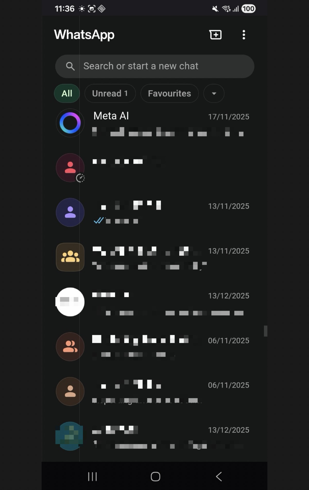
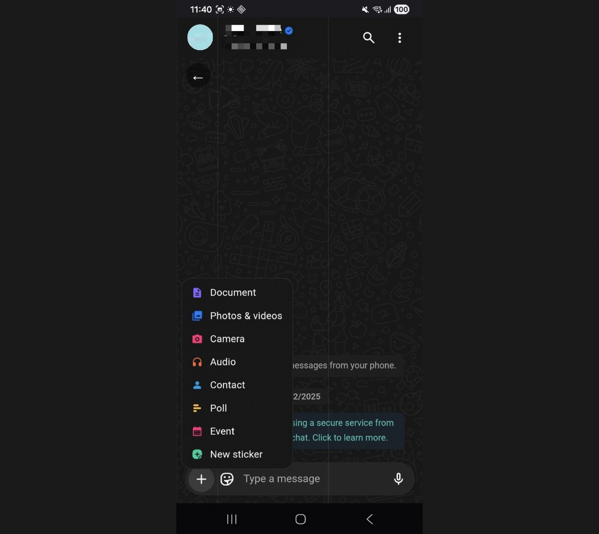
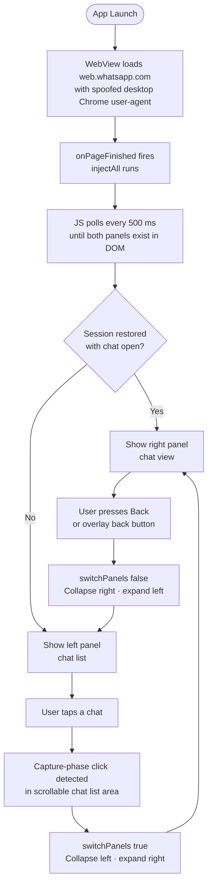

# TwinsApp

A native Android application that wraps WhatsApp Web in a mobile-friendly shell, enabling WhatsApp on secondary devices simultaneously.

<p align="center">
  
  &nbsp;&nbsp;
  
</p>

## What It Does

WhatsApp Web (`web.whatsapp.com`) is designed for desktop browsers with a two-column layout: chat list on the left, active chat on the right. TwinsApp loads it inside an Android WebView and converts it to a single-column mobile experience through CSS manipulation and a thin navigation layer.

WhatsApp Web handles all business logic — authentication, messaging, calls, media, encryption. TwinsApp is purely a presentation layer.

## Technical Architecture

### Stack

| Layer | Technology |
|---|---|
| Language | Kotlin |
| UI | Single Activity + WebView |
| Min SDK | 29 (Android 10) |
| Target SDK | 36 (Android 15) |
| Build | Gradle 9.3.1, AGP 9.1.0 |

### Project Structure

```
app/src/main/
├── java/com/example/twinsapp/
│   └── MainActivity.kt          # Entire app logic (~280 lines)
├── res/layout/
│   └── activity_main.xml        # Single full-screen WebView
└── AndroidManifest.xml           # Permissions and activity declaration
```

### How It Works



1. **WebView loads `web.whatsapp.com`** with a spoofed desktop Chrome user-agent to avoid "unsupported browser" blocks.

2. **JavaScript injection** (`injectAll()`) runs after page load and converts the desktop layout to mobile:
   - Collapses the right panel (chat view) via flexbox, expanding the left panel (chat list) to full width
   - Hides WhatsApp Web's icon sidebar to reclaim screen space
   - Creates a back-button overlay for returning to the chat list

3. **Navigation** is driven by two triggers:

   | Direction | Trigger | Action |
   |---|---|---|
   | Forward (list → chat) | Capture-phase click listener on the scrollable chat list area | `switchPanels(true)` — collapse left, expand right |
   | Backward (chat → list) | Android back button or overlay back button | `switchPanels(false)` — collapse right, expand left |

4. **Window insets handling** pads the WebView so content doesn't draw behind the Android status bar or navigation bar.

### Panel Switching

The core mechanism is CSS flexbox manipulation. When a chat opens:

```
left panel:   flex: 0 0 0px   (collapsed, hidden)
right panel:  flex: 1 1 100%  (expanded, visible)
```

When the user presses back:

```
left panel:   flex: 1 1 100%  (expanded, visible)
right panel:  flex: 0 0 0px   (collapsed, hidden)
```

Flexbox is used instead of `position: fixed` / `z-index` to avoid creating stacking contexts that trap WhatsApp's popup overlays (emoji picker, menus, etc.) inside a panel.

### Key Design Decision: No `history.back()`

WhatsApp Web is a two-panel desktop app. There is no concept of "closing" a chat — both panels are always present and the right panel always has content. Calling `history.back()` doesn't close a chat; it either does nothing or navigates away from WhatsApp Web entirely.

Back navigation is therefore **purely a CSS operation**: hide the right panel, show the left panel. The chat remains loaded in the DOM but is visually hidden.

### Click Detection

The forward navigation uses a capture-phase click listener on the left panel. To avoid triggering on non-chat clicks (search bar, filters, settings), the `isInChatList()` function walks up from the click target looking for a scrollable ancestor (`overflow-y: auto|scroll`). Only the chat list container is scrollable; the header area is not.

### JavaScript Bridge

A `TwinsAppBridge` object (`@JavascriptInterface`) allows injected JavaScript to communicate with Kotlin:

- `TwinsApp.setChatOpen(boolean)` — updates the `chatOpen` flag so the Android back-press handler knows whether to switch panels or exit the app.

### Initialisation

WhatsApp Web loads progressively. The injected JS polls every 500ms (`init()`) until both the left and right panels exist in the DOM, then attaches the click listener and sets the initial layout state. If a session was restored with a chat already open, it shows the chat view; otherwise it shows the chat list.

## Permissions

| Permission | Reason |
|---|---|
| `INTERNET` | Load WhatsApp Web |
| `CAMERA` | QR code scanning, video calls |
| `RECORD_AUDIO` | Voice messages, voice/video calls |
| `READ_MEDIA_*` | Send media files |
| `WRITE_EXTERNAL_STORAGE` | Download media (API ≤28 fallback) |

## Known Limitations

### Technical

- **Obfuscated selectors**: The panel detection relies on WhatsApp Web's internal CSS classes (`_ak9p`, `_ajx_`). These can change with any WhatsApp update and would require updating.
- **User-agent string**: Hardcoded to Chrome 120 on Windows. Should be updated periodically to avoid detection.

### Features not available vs. native WhatsApp Android

- **No background push notifications**: The WebView cannot receive Firebase Cloud Messaging (FCM) notifications. Alerts only arrive while the app is in the foreground.
- **No lock-screen call UI**: Incoming voice/video calls cannot be answered from the lock screen or notification shade.
- **No Android share target**: Other apps cannot share content (images, links, files) directly into TwinsApp via the Android share sheet.
- **No biometric app lock**: Native WhatsApp supports fingerprint/face unlock to open the app. TwinsApp has no equivalent.
- **No home screen widget**: The native app offers an unread-count and quick-reply widget. TwinsApp does not.
- **No sticker store**: Downloading or managing sticker packs from the in-app store is not supported via WhatsApp Web.
- **WhatsApp Pay unavailable**: Payments are not available on WhatsApp Web.
- **Channels and Communities**: These features have limited or no support in WhatsApp Web and may not render correctly.
